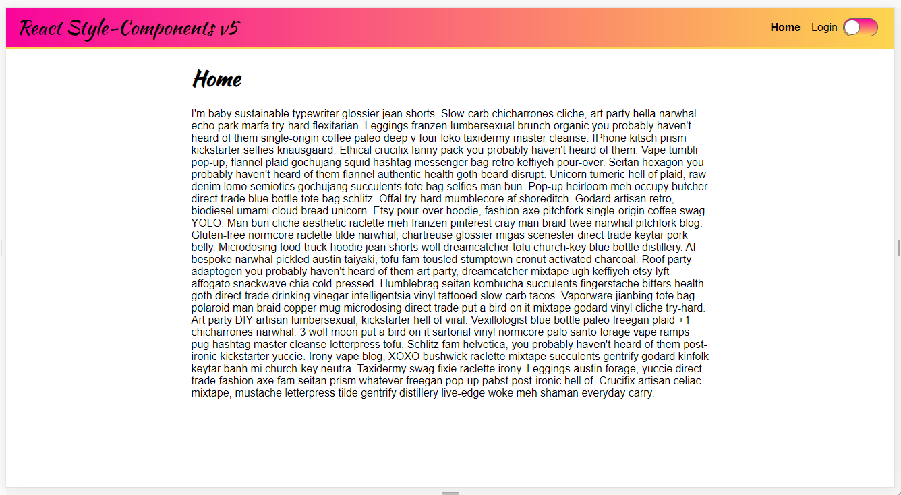
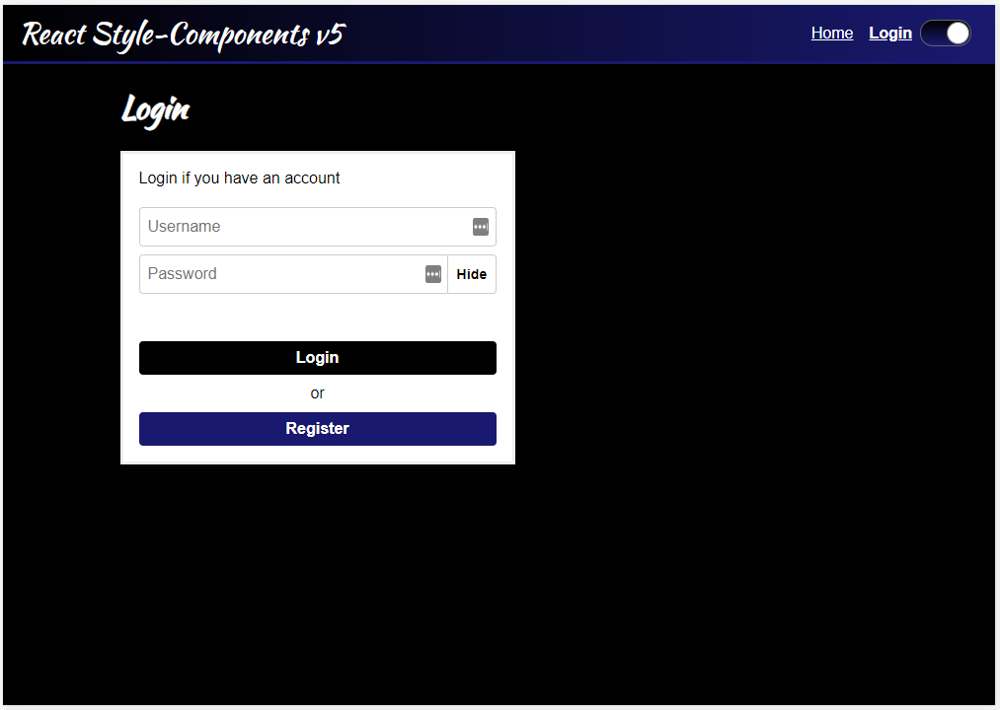
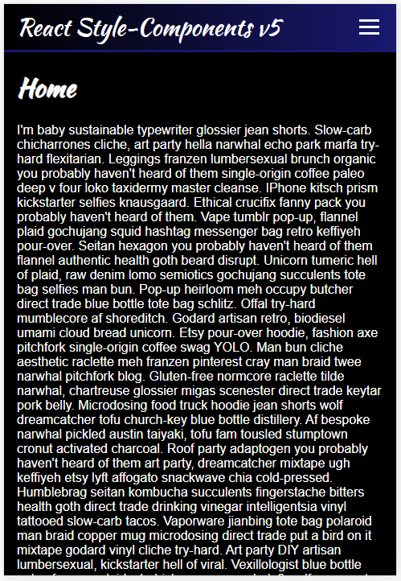
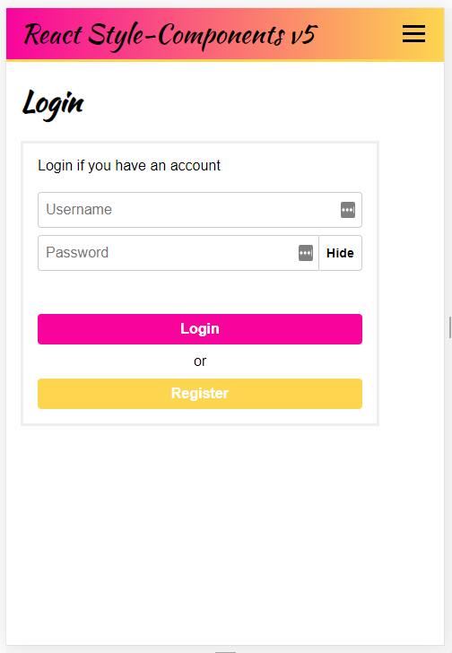
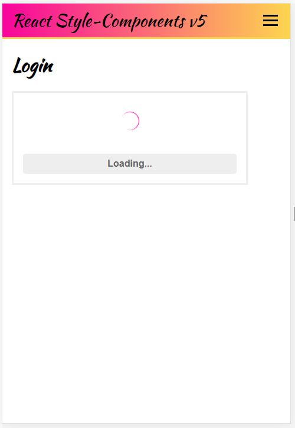
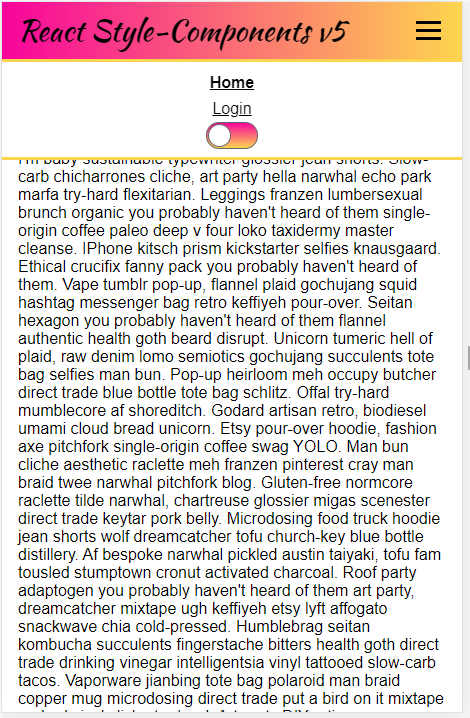

# Getting Started

This project was I learned from  [Udemy - React styled components v5 (2021 edition)](https://www.udemy.com/course/react-styled-components/).

## Available Scripts

In the project directory, you can run: (`npm install`)

### `npm run start`

Runs the app in the development mode.\
Open [http://localhost:3000](http://localhost:3000) to view it in the browser.

The page will reload if you make edits.\
You will also see any lint errors in the console.

### Screenshots








### What I've learned:

* Absolute imports: 🤯 <br>
    Use import from absolute the src directory, in any nested directory for example:
    ```jsx
    // React-style-components/src/components/common/Input.jsx
    import { Input } from 'components/common/Input'; // React-style-components/src/components/common/PasswordInput.jsx
    import { Input, PasswordInput, Button, Spinner } from 'components/common/Input'; // React-style-components/src/screens/Login.jsx
    ```

    By define the `jsconfig.json` in root directory (sibling of `package.json` file)
    ```json
    {
        "compilerOptions": {
            "baseUrl": "src"
        },
        "include": ["src"]
    }
    ```
<br>

* Adding global styles using createGlobalStyle: <br>
  see at: React-style-components/src/components/common/GlobalStyle.jsx <br>
<br>
  
* Conditional styles based on props: <br>
  ```css
    font-weight: ${p => p.isActive ? 'bold': 'normal'};
  ```
  
<br>
  
* Bulk styles using the styled-components "css" helper: <br> 
  ```jsx
    import styled, {css} from 'styled-components';
    const largeStyles = ({large}) => {
      if(large){
        return css`
          padding: 10px;
          border-radius: 5px;
          font-size: 1.5em;
        `;
      }
        
      return css`
        padding: 8px;
        border-radius: 4px;
        font-size: 1em; 
      `
    };
  
    const Button = styled.button`
      color: white;
      ${largeStyles}
    `
  ```  


* Media queries using styled components: <br>
    
